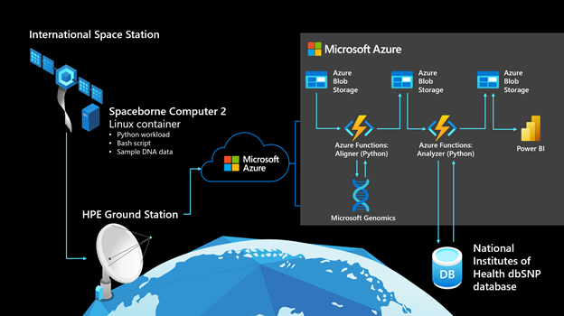

# mock-spacestation

## What is mock-spacestation?

mock-spacestation is a Bicep template and a some scripts that deploys a Mock Spacestation and Mock Groundstation to Azure to enable developers and enthusiasts to develop and test their own workloads for space with similar constraints to those seen working with the International Space Station.

This Mock Groundstation and Mock Spacestation is how the Azure Space team developed and tested their experiment workload without access to HPE's Spaceborne Computer 2 nor the International Space Station.

For context, here's a video summary of that experiment:

[](https://www.youtube.com/watch?v=wZfIUkcgVxI "Genomics testing on the ISS with HPE Spaceborne Computer-2 and Azure")

## What it simulates

1. **Latency**
  
    The Mock Groundstation is located in East US and the Mock Spacestation is located in Australia to simulate the speed of light latency and many international hops communication with the International Space Station goes through.

2. **Bandwidth**
  
    The Mock Spacestation is configured out of the box to synchronize with the Mock Groundstation at the actual bandwidth cap when communicating with the International Spacestation: 2 *megabits* per second.

3. How and why **"Burst Down"** is valuable

    When the Azure Space team performed their genomics experiment, they used High Performance Compute on the spacestation with the HPE Spaceborne Computer 2 to perform intensive work at the edge to determine what is important enough to send back to Earth, then transmitted just those important bits through the narrow 2 Mbps pipe, then scaled up analysis and compute on a global scale with Azure. 

## Get started with mock-spacestation

To get started developing your workload for space:

1. First, open this repo in **[our development environment](#Open-the-development-environment)**

2. Then, you'll **[deploy the Mock Spacestation template](#Deploy-the-template)**

3. Finally, you'll execute a small script to **[get the ssh commands to connect](#Connect-to-VMs)** to your spacestation and groundstation and **[see the `/trials/` directory synched](#Synch-the-trials-directory)** between the two with all the bandwidth and latency configured into the deployment.

## Open the development environment

(document the steps to open in):

Whether you're on Windows or Linux, it's pretty handy to use the [container described in this repository](./devcontainer/Dockerfile) as your development environment. It's what the team authored these scripts with and can best ensure compatibility.

- _how to open with GitHub Codespaces_
- _how to open with Visual Studio Code Remote - Containers extension_

## Deploy the template

### via Azure Portal

We can deploy the Mock Spacestation and Mock Groundstation to Azure from the portal with just a few clicks.

When you deploy with the Azure Portal, create yourself a new resource group:

_image creating from the portal_

And make note of the Deployment Name that gets generated for you, we'll need that to get your SSH credentials and commands:

_image indicating the deployment name_

And when you're ready, deploy to Azure:

[](https://portal.azure.com/#create/Microsoft.Template/uri/https%3A%2F%2Fraw.githubusercontent.com%2Fglennmusa%2Fmock-spacestation%2Fmain%2FmockSpacestation.json)

### via Azure CLI

If you're comfortable with the command line, the Azure CLI provides the `deployment` command to deploy the Mock Spacestation and Mock Groundstation.

First, set yourself some environment variables to make things easier, `resourceGroupName` and `deploymentName`

```plaintext
resourceGroupName="myMockSpacestation"
deploymentName="mockSpaceStationDeploy"
```

Then, create a resource group with `az group create`:

```plaintext
az group create \
  --location eastus \
  --name $resourceGroupName
```

Then you can deploy the spacestation and groundstation into that resource group with `az deployment group create`:

```plaintext
az deployment group create \
  --resource-group $resourceGroupName \
  --name $deploymentName \
  --template-file ./mockSpacestation.json
```

## Connect to VMs

After you've deployed the Mock Spacestation template, use [./getConnections.sh](./getConnections.sh), passing in the name of your resource group and the deployment name, to retrieve the commands to SSH into the deployed VMs.

```plaintext
./getConnections.sh $resourceGroupName $deploymentName

# should return something to the effect of:
# INFO: Success! Private key written to ./mockSpacestationPrivateKey. Run these commands to SSH into your machines...
# ssh -i mockSpacestationPrivateKey azureuser@mockgroundstation-abcd1234efgh5.eastus.cloudapp.azure.com
# ssh -i mockSpacestationPrivateKey azureuser@mockspacestation-abcd1234efgh5.australiaeast.cloudapp.azure.com
```

## Synch the trials directory

Once you're on the Spacestation, any files or directories that make their way to the `/home/azureuser/trials` directory will be synched to the Groundstation at 2 megabits per second every 5 minutes as seen in [scripts/configureSource.sh](scripts/configureSource.sh):

_an image showing the spacestation directory_

_an image showing the groundstation directory_

## An example "Burst Down" workload

The Azure Space team's genomics experiment is an example of a solution you could build with these mock-spacestation components:

]

More technical information on the experiment can be found at this blog post: [https://azure.microsoft.com/en-us/blog/genomics-testing-on-the-iss-with-hpe-spaceborne-computer2-and-azure/](https://azure.microsoft.com/en-us/blog/genomics-testing-on-the-iss-with-hpe-spaceborne-computer2-and-azure/)

### On the Spacestation
- A Linux container hosts a Python workload, which is packaged with data representing mutated DNA fragments and wild-type (meaning normal or non-mutated) human DNA segments. There are 80 lines of Python code, with a 30-line bash script to execute the experiment.

- The Python workload generates a configurable amount of DNA sequences (mimicking gene sequencer reads, about 70 nucleotides long) from the mutated DNA fragment.

- The Python workload uses awk and grep to compare generated reads against the wild-type human genome segments.

- If a perfect match cannot be found for a read, it’s assumed to be a potential mutation and is compressed into an output folder on the Spaceborne Computer-2 network-attached storage device.
After the Python workload completes, the compressed output folder is sent to the HPE ground station on Earth via rsync.

### On Earth
- The HPE ground station uploads the data it receives to Azure, writing it to Azure Blob Storage through azcopy.

- An event-driven, serverless function written in Python and hosted in Azure Functions monitors Blob Storage, retrieving newly received data and sending it to the Microsoft Genomics service via its REST API.

- The Microsoft Genomics service, hosted on Azure, invokes a gene sequencing pipeline to “align” each read and determine where, how well, and how unambiguously it matches the full reference human genome. (The Microsoft Genomics service is a cloud implementation of the open-source Burroughs-Wheeler Aligner and Genome Analysis Toolkit, which Microsoft tuned for the cloud.)

- Aligned reads are written back to Blob Storage in Variant Call Format (VCF), a standard for describing variations from a reference genome.

- A second serverless function hosted in Azure Functions retrieves the VCF records, using the determined location of each mutation to query the dbSNP database hosted by the National Institute of Health—as needed to determine the clinical significance of the mutation—and writes that information to a JSON file in Blob Storage.

- Power BI retrieves the data containing clinical significance of the mutated genes from Blob Storage and displays it in an easily explorable format.
